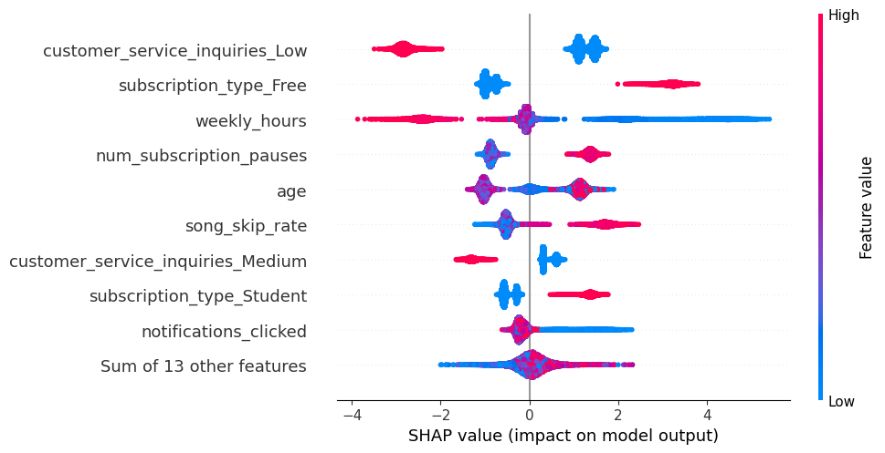
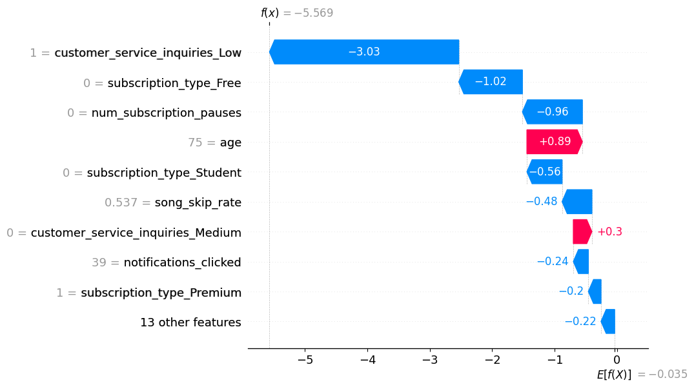
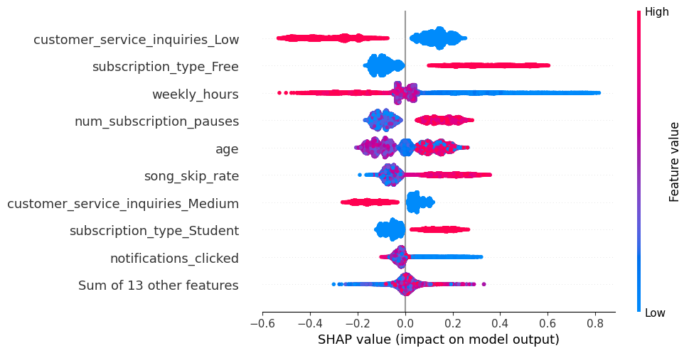
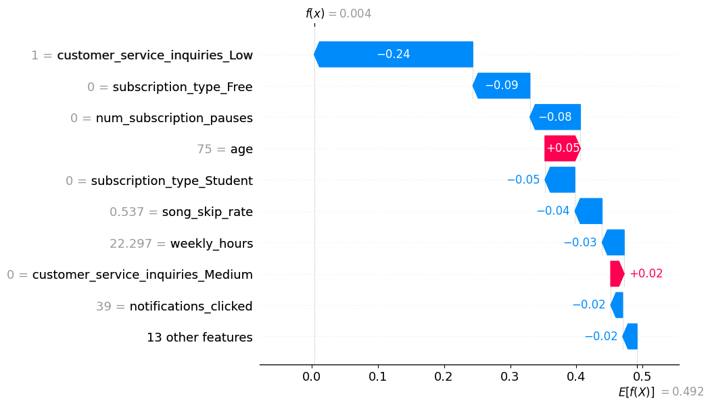

# 🔍 Customer Churn Prediction with Explainable AI (SHAP)

> Making ML models transparent — not just accurate.

---

## 📌 Overview

This project builds a customer churn prediction system for a **streaming subscription service** and goes beyond standard accuracy metrics by applying **SHAP (SHapley Additive exPlanations)** to explain *why* the model makes each prediction.

Two models are trained and compared — **XGBoost** and **Random Forest** — and SHAP's `TreeExplainer` is used to analyze feature contributions at both the **global** (all customers) and **local** (individual customer) level. The goal is to answer not just *"will this customer churn?"* but *"what is actually driving that prediction?"*

---

## 📂 Dataset

- **Source:** [Kaggle – Streaming Subscription Churn Model](https://www.kaggle.com/competitions/streaming-subscription-churn-model/data)
- **Size:** 125,000 customers
- **Target:** `churned` (binary classification)
- **Key Features:**
  - `age`, `weekly_hours`, `song_skip_rate`, `notifications_clicked`
  - `subscription_type` (Free / Student / Premium)
  - `payment_plan`, `payment_method`
  - `num_subscription_pauses`, `average_session_length`
  - `customer_service_inquiries` (Low / Medium / High)

---

## ⚙️ Workflow

```
Raw Data (train.csv)
      ↓
Exploratory Analysis (unique value inspection, correlation matrix)
      ↓
Preprocessing (drop irrelevant columns, one-hot encoding of categoricals)
      ↓
Train/Test Split (80/20, random_state=42)
      ↓
Model Training (XGBoost + Random Forest)
      ↓
Evaluation (Accuracy + Confusion Matrix)
      ↓
SHAP Analysis (TreeExplainer → Beeswarm, Waterfall, Force Plot)
      ↓
Plain-English Explanation per Customer
```

---

## 🤖 Models & Results

Both models were trained with default hyperparameters on the same split.

| Model | Accuracy | True Positives | True Negatives |
|---|---|---|---|
| XGBoost | **84.32%** | 10,826 | 10,255 |
| Random Forest | 84.30% | 10,911 | 10,165 |

XGBoost was selected for SHAP analysis as it achieved a marginally higher accuracy and is natively supported by SHAP's `TreeExplainer` with full probability output support.

---

## 🧠 SHAP Explainability

SHAP assigns each feature a value representing its contribution to a specific prediction, grounded in cooperative game theory. `TreeExplainer` is used here as it is optimized for tree-based models and supports exact (not approximate) SHAP values.

Two modes of SHAP analysis were performed:

- **Raw log-odds output** — shows feature impact on model's internal score
- **Probability output** — shows feature impact on predicted churn probability (more intuitive)

---

## 📊 Visualizations

### 1. Global Feature Importance — Beeswarm Plot (Log-odds)

Each dot is one customer. Color = feature value (red = high, blue = low). X-axis = SHAP impact on prediction.



**Key observations:**
- `customer_service_inquiries_Low = 1` strongly **reduces** churn risk (customers satisfied enough not to complain stay)
- `subscription_type_Free = 1` is a strong churn **driver** — free-tier users are much more likely to leave
- `weekly_hours` shows a wide spread — high usage (pink) reduces churn while low usage (blue) increases it significantly

---

### 2. Local Explanation — Waterfall Plot (Log-odds)

Shows how each feature pushes a single prediction away from the baseline (average model output).



**Reading this chart (Customer #0):**
- Baseline: E[f(x)] = −0.035 (average model score)
- `customer_service_inquiries_Low = 1` pulls the score down by **−3.03** (strongly reduces churn)
- `age = 75` pushes the score up by **+0.89** (older age slightly increases risk)
- Final score: f(x) = −5.569 → model predicts **not churning**

---

### 3. Global Feature Importance — Beeswarm Plot (Probability)

Same analysis re-run with `model_output="probability"` for results directly interpretable as churn probability impact.



**Key observations:**
- `subscription_type_Free` can increase churn probability by up to **+0.8** for some customers
- `weekly_hours` at very low values contributes up to **+0.85** churn probability — disengaged users are at high risk
- `customer_service_inquiries_Low` at value 1 reduces churn probability by up to **−0.6**

---

### 4. Local Explanation — Waterfall Plot (Probability)



**Reading this chart (Customer #0):**
- Baseline churn probability: **49.2%**
- `customer_service_inquiries_Low = 1` reduces it by **−0.24**
- `subscription_type_Free = 0` reduces it by **−0.09**
- Final churn probability: **0.4%** → model is very confident this customer will not churn

---

## 📋 Feature Importance Ranking (Mean |SHAP|)

| Rank | Feature | Mean |SHAP| |
|---|---|---|
| 1 | customer_service_inquiries_Low | 1.798 |
| 2 | subscription_type_Free | 1.466 |
| 3 | weekly_hours | 1.179 |
| 4 | num_subscription_pauses | 1.066 |
| 5 | age | 0.915 |
| 6 | song_skip_rate | 0.878 |
| 7 | customer_service_inquiries_Medium | 0.738 |
| 8 | subscription_type_Student | 0.701 |
| 9 | notifications_clicked | 0.294 |
| 10 | weekly_unique_songs | 0.129 |

---

## 💬 Plain-English Customer Explanation

A custom `explain_churn()` function was built to translate SHAP values into human-readable reasoning:

```
Customer 0 is unlikely to churn (score: 0.00)

Top reasons:
  - customer_service_inquiries_Low = 1.00  → decreases churn risk by 0.240
  - subscription_type_Free = 0.00          → decreases churn risk by 0.086
  - num_subscription_pauses = 0.00         → decreases churn risk by 0.076
```

This kind of output could be directly used in a business dashboard to flag at-risk customers and understand what interventions might help retain them.

---

## 🛠️ Tech Stack

| Category | Tools |
|---|---|
| Language | Python 3 |
| ML Models | XGBoost, Random Forest (scikit-learn) |
| Explainability | SHAP (TreeExplainer) |
| Data | Pandas, NumPy |
| Visualization | Matplotlib, Seaborn, SHAP plots |
| Environment | Jupyter Notebook |

---

## 📁 Project Structure

```
churn-xai/
├── churn_prediction_with_XAI.ipynb   # Main notebook
├── train.csv                          # Dataset (download from Kaggle)
├── images/
│   ├── beeswarm_raw.png
│   ├── beeswarm_probability.png
│   ├── waterfall_raw.png
│   └── waterfall_probability.png
└── README.md
```

---

## 🚀 Getting Started

```bash
# Clone the repo
git clone https://github.com/AjinkyaKhalikar/churn-prediction-xai.git
cd churn-prediction-xai

# Install dependencies
pip install xgboost shap scikit-learn pandas numpy matplotlib seaborn

# Download dataset from Kaggle and place train.csv in root directory

# Open notebook
jupyter notebook churn_prediction_with_XAI.ipynb
```

---

## 🔮 Future Work

- Apply SHAP to deep learning models (DeepExplainer / GradientExplainer)
- Add SHAP interaction values to detect feature pair effects
- Integrate NLP for interaction(Chat-bot)
- Build a Streamlit dashboard for real-time churn explanation
- Hyperparameter tuning to push accuracy beyond 84%

---

## 💡 Key Takeaway

A model that says *"this customer will churn"* is useful. A model that says *"this customer will churn because they use the free tier, skip most songs, and barely open the app"* is **actionable**. This project demonstrates that explainability isn't a nice-to-have — it's what makes ML useful in the real world.
